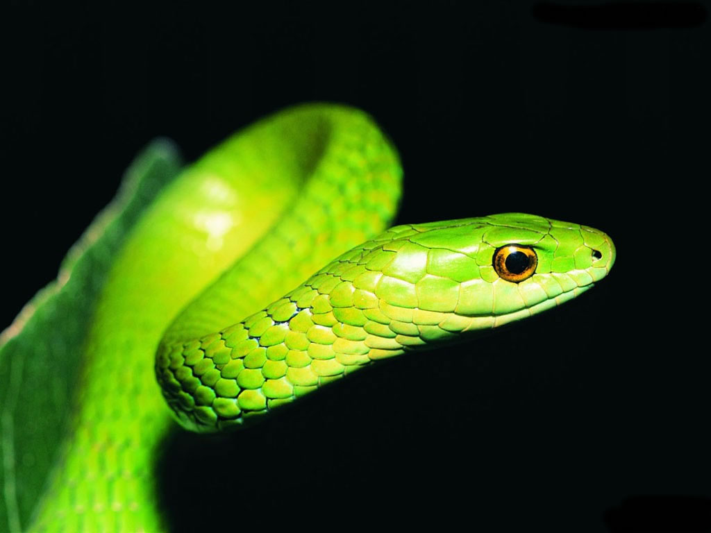
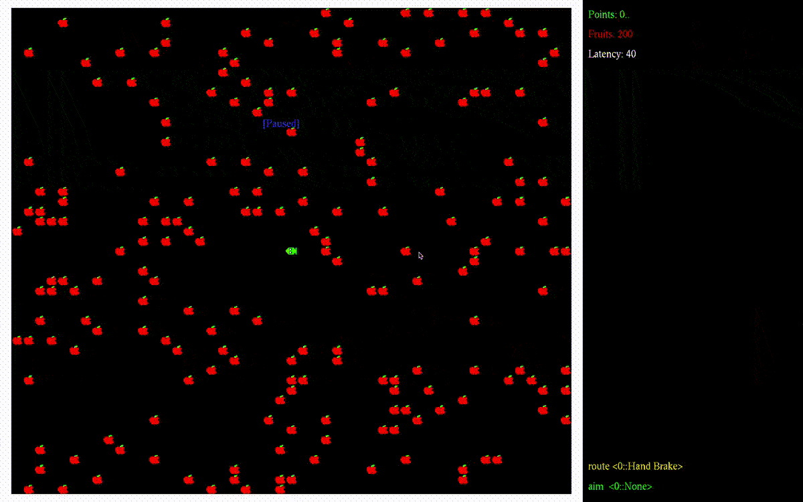

# Snake

## Author

Created by Kirill Rodriguez on 06/2014.

## Program

### Demo

I believe, this picture speaks for itself.

### Purpose

The purpose of this project was at first to practice C++ OOP and OpenGL (GLUT), but eventually it became a severe challenge of fixing the code: linkage, compilation; runtime errors and all the fun within it. It has been a rather long time since the initial code was finished, and although the code quality still remains average, it has improved A LOT since then.

### Features

* 1 snake
* 5 routing modes (4 simple AIs)
* 5 aiming modes
* Walls
* Fruits
* 8 sets of icons.
* Pause (freezes the game)
* Safe mode (makes the best AI move when the current player about to crash)
* Running mode (moves only when a button is pressed)
* Adjustable delay between iterations (keyboard `io`)
* Adjustable number of fruits (keyboard `nm`)
* Adjustable field dimensions (args)
* Has fixes for unobvious bugs
* Has obvious bugs unfixed

### Ideas

* Option to follow the cursor.
* Read walls from file.
* Mice (running fruits)
* More snakes.
* Better snake AIs (for example, one planning to target the best cluster of fruits).
* Remote intelligence.

### Contribution

Feel free to submit a pull request or an issue to inform about a bug / error.

## Usage

### Tools

* C++ compiler
* GLUT, OpenGL
* cmake
* make

### Compilation

	cmake . && make

### Running

	./_snake  [width] [height] [number-of-fruits]
	
#### Controls

* Arrows
* **p** - Toggle pause
* **r** - Toggle running mode
* **g** - Toggle safe mode
* **0-4** - change AI (aiming and/or routing)
* **0-9** - change skin
* **n**/**m** - delete/add a fruit
* **o**/**i** - reduce/increase frame interval
* **wasd** - game controls (alternatives to arrows)
* **ESC** - exit